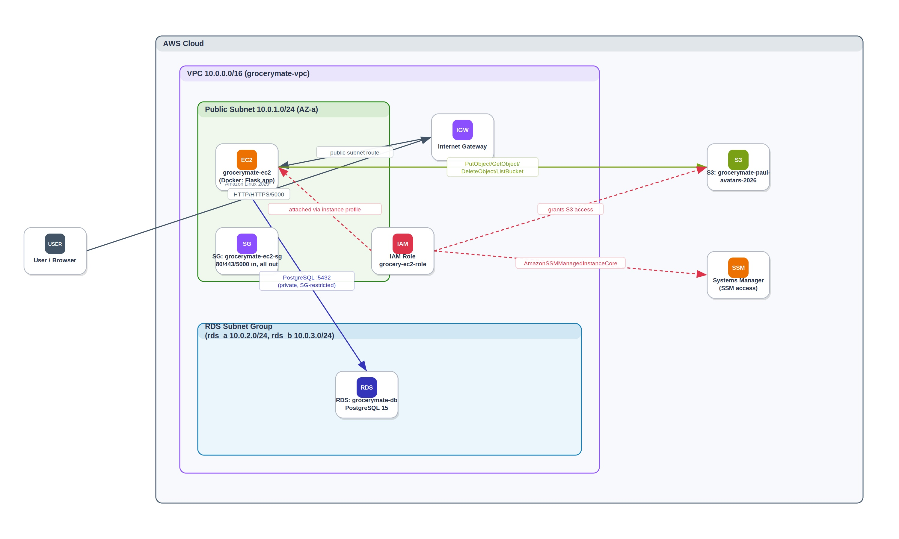
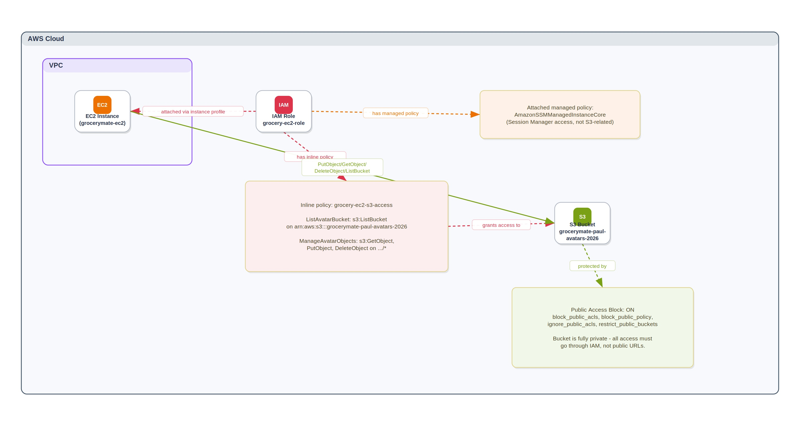
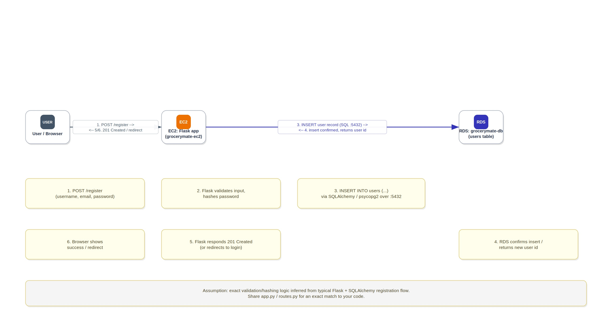
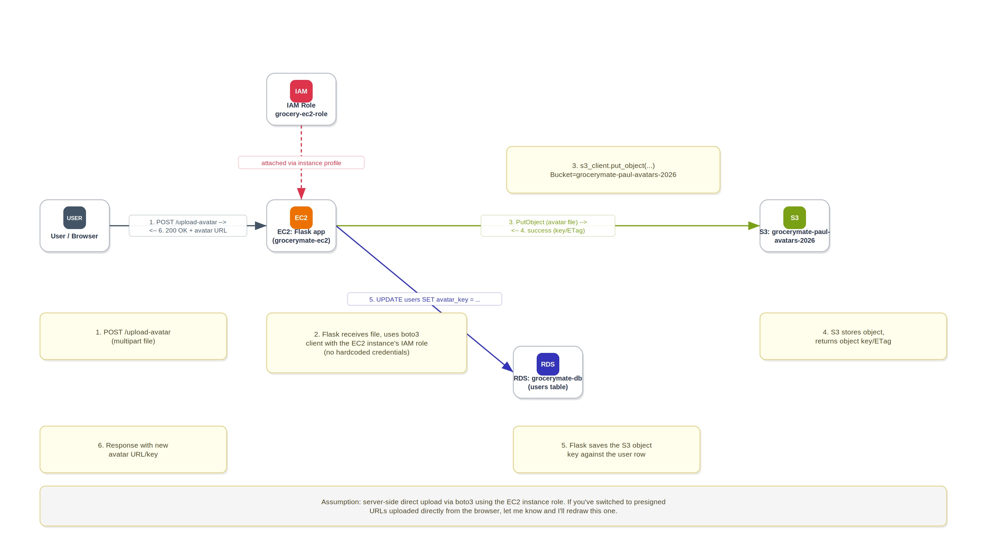

# ☁️ AWS Grocery Application

<p align="center">
  
</p>

<p align="center">
A cloud-native Grocery Management Application built with <strong>AWS</strong>, <strong>Terraform</strong>, <strong>Docker</strong>, and <strong>PostgreSQL</strong>.
</p>

---

## 📑 Table of Contents

* [Project Overview](#-project-overview)
* [Architecture](#-architecture)
* [Technologies Used](#-technologies-used)
* [AWS Services Used](#-aws-services-used)
* [1. Amazon EC2](#1-amazon-ec2)
* [2. Amazon S3](#2-amazon-s3)
* [3. Amazon RDS PostgreSQL](#3-amazon-rds-postgresql)
* [4. Amazon VPC](#4-amazon-vpc)
* [5. Internet Gateway](#5-internet-gateway)
* [6. IAM Role](#6-iam-role)
* [7. Amazon SNS](#7-amazon-sns)
* [8. Security Groups](#8-security-groups)
* [Infrastructure as Code - Terraform](#infrastructure-as-code---terraform)
* [Terraform Deployment Process](#terraform-deployment-process)
* [Docker Deployment](#docker-deployment)
* [Application Workflow](#application-workflow)
* [Security Implementation](#security-implementation)
* [Challenges & Solutions](#challenges--solutions)
* [Future Improvements](#future-improvements)
* [Author](#author)

---

## 📖 Project Overview

AWS Grocery is a cloud-native application designed to demonstrate how a backend application can be deployed and managed securely using Amazon Web Services.

The project demonstrates:

* Infrastructure as Code with Terraform
* Containerization with Docker
* Amazon EC2 compute
* Amazon S3 object storage
* Amazon RDS PostgreSQL
* Amazon SNS notifications
* IAM roles and least-privilege permissions
* VPC networking
* Private database networking
* Security Groups
* AWS Systems Manager Session Manager
* Linux administration
* Python, Flask, SQLAlchemy, and Boto3

---

## 🛠️ Technologies Used

| Category                  | Technology            |
| ------------------------- | --------------------- |
| Cloud Provider            | AWS                   |
| Infrastructure as Code    | Terraform             |
| Compute                   | Amazon EC2            |
| Object Storage            | Amazon S3             |
| Database                  | Amazon RDS PostgreSQL |
| Messaging & Notifications | Amazon SNS            |
| Containerization          | Docker                |
| Programming Language      | Python                |
| Framework                 | Flask                 |
| Database ORM              | SQLAlchemy            |
| Cloud SDK                 | Boto3                 |
| Version Control           | Git & GitHub          |
| Operating System          | Amazon Linux          |

---

## 🏗️ Architecture

The application runs on an Amazon EC2 instance inside an Amazon VPC.

The architecture contains:

* One public subnet for the EC2 instance
* Two private subnets used by the Amazon RDS DB subnet group
* An Internet Gateway for internet connectivity for the public subnet
* Security Groups controlling network traffic
* Amazon RDS PostgreSQL configured as a private database
* Amazon S3 for avatar storage
* Amazon SNS for user-registration notifications
* An IAM role attached to EC2
* AWS Systems Manager Session Manager for EC2 administration

<p align="center">
  
</p>

---

## ☁️ AWS Services Used

| AWS Service           | Purpose                                                  |
| --------------------- | -------------------------------------------------------- |
| Amazon EC2            | Hosts the backend application                            |
| Amazon S3             | Stores user avatar images                                |
| Amazon RDS PostgreSQL | Provides the managed relational database                 |
| Amazon SNS            | Sends user-registration notifications by email           |
| Amazon VPC            | Provides the isolated network                            |
| Internet Gateway      | Provides internet connectivity for the public subnet     |
| IAM                   | Provides permissions for the EC2 instance                |
| Security Groups       | Control inbound and outbound network traffic             |
| AWS Systems Manager   | Provides administrative access to EC2 without public SSH |
| Terraform             | Provisions and manages the infrastructure                |
| Docker                | Containerizes the application                            |

---

# 1. Amazon EC2

## Purpose

Amazon EC2 provides the compute environment where the backend application runs.

The application is deployed inside a Docker container running on an Amazon Linux EC2 instance.

## Configuration

* **Instance Type:** Configured through the Terraform `ec2_instance_type` variable
* **Operating System:** Amazon Linux
* **Subnet:** Public subnet
* **IAM Instance Profile:** `${var.project_name}-ec2`

The EC2 instance is deployed in the public subnet so that the application can receive web traffic and communicate with the internet.

## Network Access

The EC2 Security Group allows:

| Port | Protocol | Purpose           |
| ---- | -------- | ----------------- |
| 80   | TCP      | HTTP web traffic  |
| 443  | TCP      | HTTPS web traffic |
| 5000 | TCP      | Flask application |

### Administration

Port **22/SSH is not publicly exposed**.

EC2 administration is performed using **AWS Systems Manager Session Manager**, avoiding the need to expose SSH to the internet.

---

# 2. Amazon S3

## Purpose

Amazon S3 stores user-uploaded profile/avatar images.

The bucket name is configured through the Terraform variable:

```text
avatars_bucket_name
```

<p align="center">
  
</p>

## Security

Amazon S3 Block Public Access is enabled for the avatar bucket.

The following controls are enabled:

* `block_public_acls`
* `block_public_policy`
* `ignore_public_acls`
* `restrict_public_buckets`

The EC2 IAM role is granted access only to the configured avatar bucket instead of using the broad `AmazonS3FullAccess` managed policy.

The application can:

* List the avatar bucket
* Upload objects
* Download objects
* Delete objects

No AWS access keys are stored inside the application.

## Application Workflow

1. User uploads an avatar.
2. Flask receives the image.
3. The application uses Boto3 to communicate with Amazon S3.
4. The image is stored in the S3 bucket.
5. The application stores the image reference in the database.

---

# 3. Amazon RDS PostgreSQL

## Purpose

Amazon RDS provides the managed PostgreSQL database used by the application.

The database is deployed using Terraform and is **not publicly accessible**.

## Configuration

* **Engine:** PostgreSQL
* **Engine Version:** PostgreSQL 15
* **Instance Class:** Configured through the Terraform `rds_instance_class` variable
* **Storage:** 20 GB
* **Database Name:** `grocerymate_db`
* **Username:** `grocery_user`
* **Publicly Accessible:** `false`
* **Storage Encryption:** Enabled

The database password is provided through the Terraform `db_password` variable and is not hardcoded in the Terraform resource.

## Network Architecture

RDS uses a DB subnet group containing two subnets:

| Subnet       | CIDR                                   | Availability Zone       |
| ------------ | -------------------------------------- | ----------------------- |
| RDS Subnet A | Configured through `rds_subnet_a_cidr` | `availability_zones[0]` |
| RDS Subnet B | Configured through `rds_subnet_b_cidr` | `availability_zones[1]` |

The RDS Security Group allows PostgreSQL traffic on port **5432 only from the EC2 Security Group**.

Therefore:

```text
Internet
   │
   ▼
EC2
   │
   │ TCP 5432
   ▼
Private RDS
```

RDS does not accept direct database connections from the public internet.

---

# 4. Amazon VPC

## Purpose

Amazon VPC provides the isolated networking environment for the application.

## Network Configuration

| Resource      | Configuration                           |
| ------------- | --------------------------------------- |
| VPC           | Configured through `vpc_cidr`           |
| Public Subnet | Configured through `public_subnet_cidr` |
| RDS Subnet A  | Configured through `rds_subnet_a_cidr`  |
| RDS Subnet B  | Configured through `rds_subnet_b_cidr`  |

The AWS region is configured through the Terraform `aws_region` variable.

The Availability Zones are configured through the Terraform `availability_zones` variable rather than being hardcoded throughout the infrastructure.

---

# 5. Internet Gateway

## Purpose

The Internet Gateway provides internet connectivity for resources deployed in the public subnet.

The public subnet is associated with a route table containing a default route to the Internet Gateway.

The EC2 instance is deployed in this public subnet.

The RDS subnets are not associated with the public route table, and RDS is configured with:

```text
publicly_accessible = false
```

---

# 6. IAM Role

## Purpose

IAM controls the permissions granted to the EC2 instance.

The EC2 instance uses an IAM role configured through Terraform.

An IAM Instance Profile attaches this role to EC2.

## Permissions

### Amazon S3

The EC2 instance receives a custom policy scoped to the configured avatar bucket.

The policy allows only the S3 operations required by the application:

* `s3:ListBucket`
* `s3:GetObject`
* `s3:PutObject`
* `s3:DeleteObject`

### Amazon SNS

The EC2 IAM role is allowed to publish messages only to the user-registration SNS topic:

```text
sns:Publish
```

The SNS topic ARN is referenced dynamically through Terraform rather than hardcoded.

### AWS Systems Manager

The role also includes:

```text
AmazonSSMManagedInstanceCore
```

This allows Systems Manager to manage the EC2 instance without requiring publicly exposed SSH access.

---

# 7. Amazon SNS

## Purpose

Amazon Simple Notification Service (SNS) is used to send notifications when a user registers in the application.

The Flask backend publishes a user-registration notification to an SNS topic using the EC2 IAM role.

## SNS Topic

The topic is created and managed using Terraform.

Its name is generated using the Terraform `project_name` variable:

```text
${var.project_name}-user-registration
```

## Email Subscription

The SNS topic has an email subscription.

The email endpoint is provided through the Terraform variable:

```text
sns_notification_email
```

The value is stored in the local `terraform.tfvars` file, which is excluded from Git using `.gitignore`.

After deployment, the email recipient must confirm the SNS subscription before receiving notifications.

## Application Workflow

```text
User
   │
   ▼
Flask Backend
   │
   ├───────────────► Amazon RDS PostgreSQL
   │
   │ sns:Publish
   ▼
Amazon SNS
   │
   │ Email Notification
   ▼
Email Subscriber
```

## Security

* SNS is managed through Terraform.
* EC2 uses its IAM role to publish messages.
* No AWS access keys are stored in the application.
* The IAM permission is restricted to `sns:Publish`.
* The permission is scoped to the specific user-registration SNS topic.

---

# 8. Security Groups

## EC2 Security Group

The EC2 Security Group allows:

| Port | Source      | Purpose           |
| ---- | ----------- | ----------------- |
| 80   | `0.0.0.0/0` | HTTP              |
| 443  | `0.0.0.0/0` | HTTPS             |
| 5000 | `0.0.0.0/0` | Flask application |

Outbound traffic is allowed.

SSH port 22 is **not exposed**.

## RDS Security Group

The RDS Security Group allows:

| Port | Source             | Purpose    |
| ---- | ------------------ | ---------- |
| 5432 | EC2 Security Group | PostgreSQL |

This prevents external clients from directly accessing the database.

---

# Infrastructure as Code - Terraform

Terraform is used to provision and manage the AWS infrastructure.

The infrastructure is divided into multiple Terraform files according to resource type.

Examples include:

* `vpc.tf`
* `subnet.tf`
* `route_table.tf`
* `route_association.tf`
* `internet_gateway.tf`
* `security_groups.tf`
* `ec2.tf`
* `rds.tf`
* `s3.tf`
* `iam.tf`
* `sns.tf`
* `variables.tf`
* `outputs.tf`

Terraform variables are used for configurable values such as:

* AWS region
* Project name
* Environment
* VPC CIDR
* Subnet CIDRs
* Availability Zones
* EC2 instance type
* RDS instance class
* Database password
* Avatar bucket name
* SNS notification email

Sensitive values such as the database password are supplied through Terraform variables.

The local `terraform.tfvars` file is excluded from Git using `.gitignore`.

Terraform resource references are used instead of hardcoding AWS-generated values such as resource IDs and ARNs.

---

# Terraform Deployment Process

## 1. Initialize Terraform

```bash
terraform init
```

Initializes the Terraform working directory and downloads the required providers.

---

## 2. Validate the Configuration

```bash
terraform validate
```

Checks whether the Terraform configuration is syntactically valid.

---

## 3. Format the Configuration

```bash
terraform fmt
```

Formats Terraform files according to Terraform's standard formatting rules.

---

## 4. Review the Execution Plan

```bash
terraform plan
```

Shows which resources Terraform intends to create, modify, or destroy.

---

## 5. Deploy the Infrastructure

```bash
terraform apply
```

Applies the Terraform configuration to AWS.

---

## 6. Review Outputs

```bash
terraform output
```

The Terraform outputs provide useful infrastructure information such as:

* EC2 instance ID
* EC2 private IP
* RDS endpoint
* S3 avatar bucket name

Sensitive values should not be exposed through Terraform outputs.

---

# Docker Deployment

The backend application is containerized using Docker.

## Build the Docker Image

```bash
docker build -t grocery-app .
```

## Run the Container

The application receives database configuration through environment variables rather than hardcoding credentials inside the image.

```bash
docker run \
  --network host \
  -e POSTGRES_USER=grocery_user \
  -e POSTGRES_PASSWORD=<DB_PASSWORD> \
  -e POSTGRES_DB=grocerymate_db \
  grocery-app
```

`<DB_PASSWORD>` represents the database password and must not be committed to GitHub.

---

# Application Workflow

## User Registration

When a user registers, the Flask backend communicates with Amazon RDS to store the user information.

The backend can also publish a user-registration notification to Amazon SNS using the EC2 IAM role.

```text
User
   │
   ▼
Flask Backend
   │
   ├───────────────► Amazon RDS PostgreSQL
   │
   │ sns:Publish
   ▼
Amazon SNS
   │
   ▼
Email Subscriber
```

<p align="center">
  
</p>

---

## Avatar Upload

<p align="center">
  
</p>

```text
User
   │
   ▼
Flask Backend
   │
   ▼
Boto3
   │
   ▼
Amazon S3
   │
   ▼
Avatar Object
```

---

# Security Implementation

## Identity and Access Management

* EC2 uses an IAM role.
* No AWS access keys are stored in the application.
* S3 permissions are scoped to the application's avatar bucket.
* SNS permissions are restricted to `sns:Publish` on the user-registration topic.
* AWS Systems Manager is used for EC2 administration.
* AWS-generated resource ARNs are referenced dynamically through Terraform.

## Network Security

* Resources are deployed inside an Amazon VPC.
* RDS uses two subnets through its DB subnet group.
* RDS is not publicly accessible.
* RDS accepts PostgreSQL traffic only from the EC2 Security Group.
* SSH is not publicly exposed.
* Security Groups restrict inbound traffic to the required application ports.

## S3 Security

* S3 Block Public Access is enabled.
* Public ACLs are blocked.
* Public bucket policies are blocked.
* Public access is restricted.
* EC2 receives only the S3 permissions required by the application.

## Database Security

* RDS is configured with `publicly_accessible = false`.
* Storage encryption is enabled.
* PostgreSQL access is restricted to the EC2 Security Group.
* The database password is supplied through a Terraform variable rather than being hardcoded in the resource configuration.

## SNS Security

* The EC2 IAM role can publish only to the user-registration topic.
* The application does not use AWS access keys.
* The notification email is supplied through a Terraform variable.
* The SNS email subscription requires confirmation.

---

# Challenges & Solutions

Throughout the project, several real-world cloud engineering challenges were encountered and resolved.

| Challenge                  | Solution                                                                                     |
| -------------------------- | -------------------------------------------------------------------------------------------- |
| AWS SSO authentication     | Configured AWS CLI using AWS IAM Identity Center                                             |
| Docker networking          | Used host networking to allow the application to communicate with the database               |
| EC2 permissions            | Used an IAM role instead of storing AWS credentials                                          |
| Excessive S3 permissions   | Replaced broad S3 permissions with a bucket-specific custom policy                           |
| Public S3 access           | Enabled S3 Block Public Access                                                               |
| Public database exposure   | Configured RDS as non-public and used a dedicated DB subnet group                            |
| Public SSH exposure        | Removed SSH access and configured AWS Systems Manager                                        |
| Hardcoded Terraform values | Replaced configurable infrastructure values with Terraform variables                         |
| Database credentials       | Removed hardcoded credentials from version-controlled Terraform configuration                |
| Hardcoded AWS ARNs         | Replaced manually entered ARNs with Terraform resource references                            |
| Terraform state drift      | Used `terraform plan` and `terraform apply` to reconcile infrastructure with Terraform state |
| Infrastructure validation  | Used `terraform fmt`, `terraform validate`, and `terraform plan` before applying changes     |
| User notifications         | Added Amazon SNS with an email subscription and least-privilege EC2 permissions              |

---

# Future Improvements

Potential future improvements include:

* Application Load Balancer
* HTTPS with AWS Certificate Manager
* Route 53
* CloudWatch monitoring and alarms
* AWS CloudTrail
* Amazon GuardDuty
* AWS WAF
* CI/CD pipeline
* Remote Terraform state using Amazon S3 with appropriate state locking
* Further IAM policy refinement
* Improved network architecture with additional private application subnets
* NAT Gateway if private application resources require outbound internet access

---

# Author

**Paul Evens Destima**

Junior Cloud Engineer

### Technical Skills

* AWS
* Terraform
* Docker
* Python
* Flask
* PostgreSQL
* Linux
* Git
* AWS IAM
* AWS VPC
* AWS S3
* AWS EC2
* AWS RDS
* Amazon SNS
