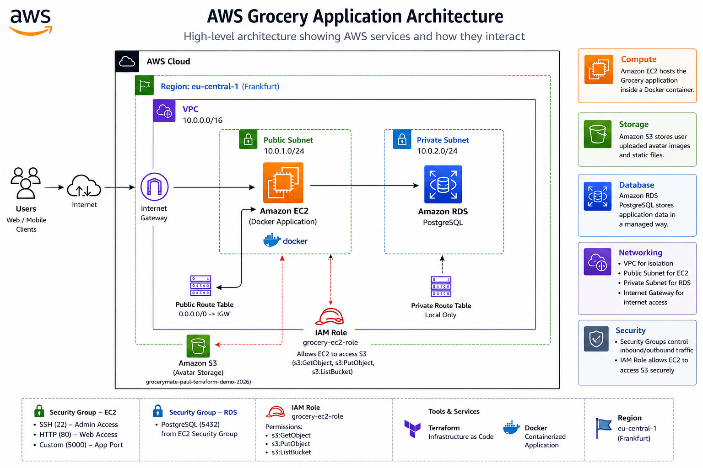
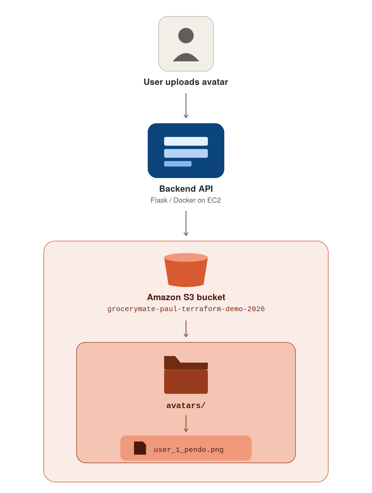
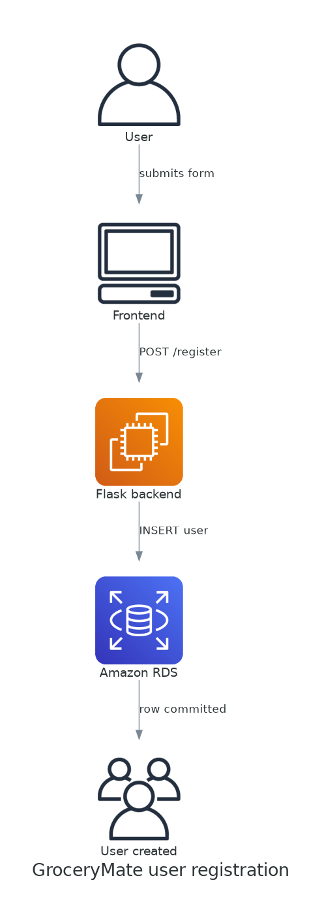
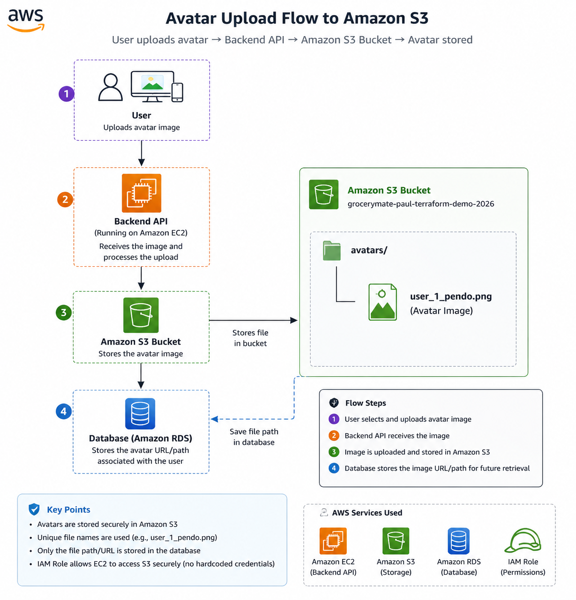

# ☁️ AWS Grocery Application

<p align="center">
  
</p>

<p align="center">
A cloud-native Grocery Management Application built with <strong>AWS</strong>, <strong>Terraform</strong>, <strong>Docker</strong>, and <strong>PostgreSQL</strong>.
</p>

---

## 📑 Table of Contents

* [Project Overview](#-project-overview)
* [Architecture](#-architecture)
* [AWS Services Used](#-aws-services-used)
* [Amazon EC2](#1-amazon-ec2)
* [Amazon S3](#2-amazon-s3)
* [Amazon RDS PostgreSQL](#3-amazon-rds-postgresql)
* [Amazon VPC](#4-amazon-vpc)
* [Internet Gateway](#5-internet-gateway)
* [IAM Role](#6-iam-role)
* [Security Groups](#7-security-groups)
* [Infrastructure as Code - Terraform](#infrastructure-as-code---terraform)
* [Terraform Deployment Process](#terraform-deployment-process)
* [Docker Deployment](#docker-deployment)
* [Application Workflow](#application-workflow)
* [Security Implementation](#security-implementation)
* [Challenges & Solutions](#challenges--solutions)
* [Future Improvements](#future-improvements)
* [Author](#author)

---

## 📖 Project Overview

AWS Grocery is a cloud-native application designed to demonstrate how a backend application can be deployed and secured using Amazon Web Services.

The project demonstrates:

* Infrastructure as Code with Terraform
* Containerization with Docker
* Amazon EC2 compute
* Amazon S3 object storage
* Amazon RDS PostgreSQL
* IAM roles and least-privilege permissions
* VPC networking
* Private database networking
* Security Groups
* AWS Systems Manager Session Manager
* Linux administration

---

## 🛠️ Technologies Used

| Category               | Technology            |
| ---------------------- | --------------------- |
| Cloud Provider         | AWS                   |
| Infrastructure as Code | Terraform             |
| Compute                | Amazon EC2            |
| Object Storage         | Amazon S3             |
| Database               | Amazon RDS PostgreSQL |
| Containerization       | Docker                |
| Programming Language   | Python                |
| Framework              | Flask                 |
| Database ORM           | SQLAlchemy            |
| Cloud SDK              | Boto3                 |
| Version Control        | Git & GitHub          |
| Operating System       | Amazon Linux          |

---

## 🏗️ Architecture

The application runs on an Amazon EC2 instance inside an Amazon VPC.

The architecture contains:

* One public subnet for the EC2 instance
* Two private subnets for Amazon RDS
* An Internet Gateway for internet connectivity
* Security Groups controlling network traffic
* Amazon RDS PostgreSQL deployed privately
* Amazon S3 for avatar storage
* An IAM role attached to EC2
* AWS Systems Manager Session Manager for EC2 administration

<p align="center">
  
</p>

---

## ☁️ AWS Services Used

| AWS Service           | Purpose                                                  |
| --------------------- | -------------------------------------------------------- |
| Amazon EC2            | Hosts the backend application                            |
| Amazon S3             | Stores user avatar images                                |
| Amazon RDS PostgreSQL | Managed relational database                              |
| Amazon VPC            | Provides the isolated network                            |
| Internet Gateway      | Provides internet connectivity for the public subnet     |
| IAM                   | Provides secure permissions for EC2                      |
| Security Groups       | Control inbound and outbound network traffic             |
| AWS Systems Manager   | Provides administrative access to EC2 without public SSH |
| Terraform             | Infrastructure as Code                                   |
| Docker                | Containerizes the application                            |

---

# 1. Amazon EC2

## Purpose

Amazon EC2 provides the compute environment where the backend application runs.

The application is deployed inside a Docker container running on an Amazon Linux EC2 instance.

## Configuration

* **Instance Type:** Configured through the Terraform `ec2_instance_type` variable
* **Operating System:** Amazon Linux
* **Subnet:** Public subnet
* **IAM Instance Profile:** `grocery-ec2-role`

The EC2 instance is deployed in the public subnet so that the application can receive web traffic and communicate with the internet.

## Network Access

The EC2 Security Group allows:

| Port | Protocol | Purpose           |
| ---- | -------- | ----------------- |
| 80   | TCP      | HTTP web traffic  |
| 443  | TCP      | HTTPS web traffic |
| 5000 | TCP      | Flask backend API |

### Administration

Port **22/SSH is not publicly exposed**.

EC2 administration is performed using **AWS Systems Manager Session Manager**, avoiding the need to expose SSH to the internet.

---

# 2. Amazon S3

## Purpose

Amazon S3 stores user-uploaded profile/avatar images.

The project uses the following bucket:

`grocerymate-paul-avatars-2026`

<p align="center">
  
</p>

## Security

Amazon S3 Block Public Access is enabled for the avatar bucket.

The following controls are enabled:

* `block_public_acls`
* `block_public_policy`
* `ignore_public_acls`
* `restrict_public_buckets`

The EC2 IAM role is granted access only to the avatar bucket instead of using the broad `AmazonS3FullAccess` managed policy.

The application can:

* List the avatar bucket
* Upload objects
* Download objects
* Delete objects

No AWS access keys are stored inside the application.

## Application Workflow

1. User uploads an avatar.
2. Flask receives the image.
3. The application uses Boto3 to communicate with Amazon S3.
4. The image is stored in the S3 bucket.
5. The application stores the image reference in the database.

---

# 3. Amazon RDS PostgreSQL

## Purpose

Amazon RDS provides the managed PostgreSQL database used by the application.

The database is deployed using Terraform and is **not publicly accessible**.

## Configuration

* **Engine:** PostgreSQL
* **Engine Version:** PostgreSQL 15
* **Instance Class:** Configured through the Terraform `rds_instance_class` variable
* **Storage:** 20 GB
* **Database Name:** `grocerymate_db`
* **Username:** `grocery_user`
* **Publicly Accessible:** `false`
* **Storage Encryption:** Enabled

## Network Architecture

RDS is deployed inside a private DB subnet group containing two private subnets:

| Subnet               | CIDR          | Availability Zone                          |
| -------------------- | ------------- | ------------------------------------------ |
| RDS Private Subnet A | `10.0.2.0/24` | Configured through `availability_zones[0]` |
| RDS Private Subnet B | `10.0.3.0/24` | Configured through `availability_zones[1]` |

The RDS Security Group allows PostgreSQL traffic on port **5432 only from the EC2 Security Group**.

Therefore:

```text
Internet
   │
   ▼
EC2
   │
   │ TCP 5432
   ▼
Private RDS
```

RDS does not accept direct database connections from the public internet.

---

# 4. Amazon VPC

## Purpose

Amazon VPC provides the isolated networking environment for the application.

## Network Configuration

| Resource             | CIDR          |
| -------------------- | ------------- |
| VPC                  | `10.0.0.0/16` |
| Public Subnet        | `10.0.1.0/24` |
| Private RDS Subnet A | `10.0.2.0/24` |
| Private RDS Subnet B | `10.0.3.0/24` |

The AWS region is configured through the Terraform `aws_region` variable.

The Availability Zones are configured through the Terraform `availability_zones` variable rather than being hardcoded throughout the infrastructure.

---

# 5. Internet Gateway

## Purpose

The Internet Gateway provides internet connectivity for resources deployed in the public subnet.

The public subnet is associated with a route table containing a default route to the Internet Gateway.

The EC2 instance is deployed in this public subnet.

The RDS subnets do not use the public route table and RDS is configured with:

```text
publicly_accessible = false
```

---

# 6. IAM Role

## Purpose

IAM controls the permissions granted to the EC2 instance.

The EC2 instance uses the IAM role:

`grocery-ec2-role`

An IAM Instance Profile attaches this role to EC2.

## Permissions

The role includes:

### Amazon S3

The EC2 instance receives a custom policy scoped to:

`grocerymate-paul-avatars-2026`

The policy allows only the S3 operations required by the application.

### AWS Systems Manager

The role also includes:

`AmazonSSMManagedInstanceCore`

This allows Systems Manager to manage the EC2 instance without requiring publicly exposed SSH access.

---

# 7. Security Groups

## EC2 Security Group

The EC2 Security Group allows:

| Port | Source      | Purpose           |
| ---- | ----------- | ----------------- |
| 80   | `0.0.0.0/0` | HTTP              |
| 443  | `0.0.0.0/0` | HTTPS             |
| 5000 | `0.0.0.0/0` | Flask application |

Outbound traffic is allowed.

SSH port 22 is **not exposed**.

## RDS Security Group

The RDS Security Group allows:

| Port | Source             | Purpose    |
| ---- | ------------------ | ---------- |
| 5432 | EC2 Security Group | PostgreSQL |

This prevents external clients from directly accessing the database.

---

# Infrastructure as Code - Terraform

Terraform is used to provision and manage the AWS infrastructure.

The infrastructure is divided into multiple Terraform files according to resource type.

Examples include:

* `vpc.tf`
* `subnet.tf`
* `route_table.tf`
* `route_association.tf`
* `internet_gateway.tf`
* `security_groups.tf`
* `ec2.tf`
* `rds.tf`
* `s3.tf`
* `iam.tf`
* `variables.tf`
* `outputs.tf`

Terraform variables are used for configurable values such as:

* AWS region
* Project name
* Availability Zones
* EC2 instance type
* RDS instance class
* Database password

Sensitive values such as the database password are supplied through Terraform variables and the local `terraform.tfvars` file is excluded from Git using `.gitignore`.

---

# Terraform Deployment Process

## 1. Initialize Terraform

```bash
terraform init
```

Initializes the Terraform working directory and downloads the required providers.

---

## 2. Validate the Configuration

```bash
terraform validate
```

Checks whether the Terraform configuration is syntactically valid.

---

## 3. Review the Execution Plan

```bash
terraform plan
```

Shows which resources Terraform intends to create, modify, or destroy.

---

## 4. Deploy the Infrastructure

```bash
terraform apply
```

Applies the Terraform configuration to AWS.

---

## 5. Review Outputs

```bash
terraform output
```

The Terraform outputs provide useful infrastructure information such as:

* EC2 instance ID
* EC2 private IP
* RDS endpoint
* S3 avatar bucket name

Sensitive values should not be exposed through Terraform outputs.

---

# Docker Deployment

The backend application is containerized using Docker.

## Build the Docker Image

```bash
docker build -t grocery-app .
```

## Run the Container

The application receives database configuration through environment variables rather than hardcoding credentials inside the image.

```bash
docker run \
  --network host \
  -e POSTGRES_USER=grocery_user \
  -e POSTGRES_PASSWORD=<DB_PASSWORD> \
  -e POSTGRES_DB=grocerymate_db \
  grocery-app
```

`<DB_PASSWORD>` represents the database password and must not be committed to GitHub.

---

# Application Workflow

## User Registration

```text
User
   │
   ▼
Flask Backend
   │
   ▼
Amazon RDS PostgreSQL
   │
   ▼
User Created
```

<p align="center">
  
</p>

---

## Avatar Upload

<p align="center">
  
</p>

```text
User
   │
   ▼
Flask Backend
   │
   ▼
Boto3
   │
   ▼
Amazon S3
   │
   ▼
Avatar Object
```

---

# Security Implementation

## Identity and Access Management

* EC2 uses an IAM role.
* No AWS access keys are stored in the application.
* S3 permissions are scoped to the application's avatar bucket.
* AWS Systems Manager is used for EC2 administration.

## Network Security

* Resources are deployed inside an Amazon VPC.
* RDS uses private subnets.
* RDS is not publicly accessible.
* RDS accepts PostgreSQL traffic only from EC2.
* SSH is not publicly exposed.
* Security Groups restrict inbound traffic to the required application ports.

## S3 Security

* S3 Block Public Access is enabled.
* Public ACLs are blocked.
* Public bucket policies are blocked.
* Public access is restricted.
* EC2 receives only the S3 permissions required by the application.

## Database Security

* RDS is deployed in private subnets.
* RDS is configured with `publicly_accessible = false`.
* Storage encryption is enabled.
* PostgreSQL access is restricted to the EC2 Security Group.

---

# Challenges & Solutions

Throughout the project, several real-world cloud engineering challenges were encountered and resolved.

| Challenge                  | Solution                                                                                     |
| -------------------------- | -------------------------------------------------------------------------------------------- |
| AWS SSO authentication     | Configured AWS CLI using AWS IAM Identity Center                                             |
| Docker networking          | Used host networking to allow the application to communicate with the database               |
| EC2 permissions            | Used an IAM role instead of storing AWS credentials                                          |
| Excessive S3 permissions   | Replaced `AmazonS3FullAccess` with a bucket-specific custom policy                           |
| Public S3 access           | Enabled S3 Block Public Access                                                               |
| Public database exposure   | Moved RDS into private subnets and disabled public accessibility                             |
| Public SSH exposure        | Removed SSH access and configured AWS Systems Manager                                        |
| Hardcoded Terraform values | Replaced configurable values with Terraform variables                                        |
| Database credentials       | Removed hardcoded credentials from version-controlled Terraform configuration                |
| Terraform state drift      | Used `terraform plan` and `terraform apply` to reconcile infrastructure with Terraform state |
| Infrastructure validation  | Used `terraform validate` and `terraform plan` before applying changes                       |

---

# Future Improvements

Potential future improvements include:

* AWS Network Firewall
* Route 53
* Application Load Balancer
* HTTPS with AWS Certificate Manager
* CloudWatch monitoring and alarms
* AWS CloudTrail
* Amazon GuardDuty
* AWS WAF
* CI/CD pipeline
* Remote Terraform state using Amazon S3 and DynamoDB locking
* Further IAM policy refinement

---

# Author

**Paul Evens Destima**

Junior Cloud Engineer

### Technical Skills

* AWS
* Terraform
* Docker
* Python
* Flask
* PostgreSQL
* Linux
* Git
* AWS IAM
* AWS VPC
* AWS S3
* AWS EC2
* AWS RDS
