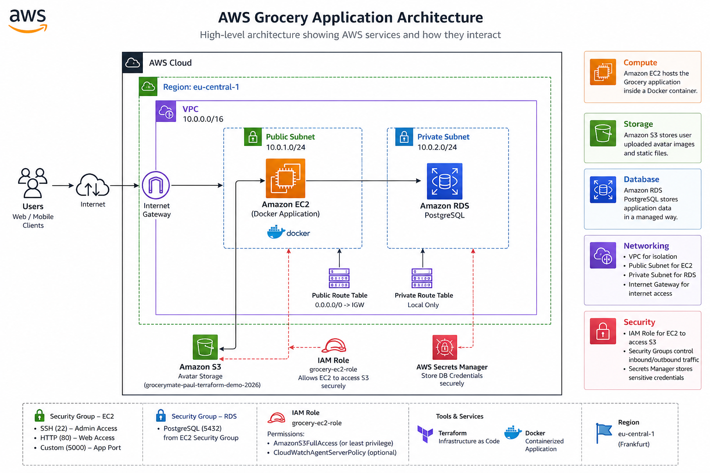
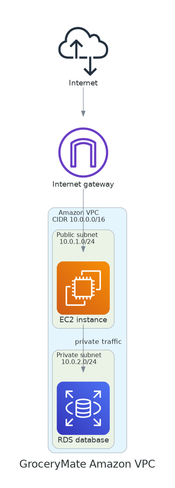

## ☁️ AWS Grocery Application

<p align="center">
  <!-- Add architecture image here later -->
  <!--  -->
</p>

<p align="center">
A cloud-native Grocery Management Application built with <strong>AWS</strong>, <strong>Terraform</strong>, <strong>Docker</strong>, and <strong>PostgreSQL</strong>.
</p>

---

## 📑 Table of Contents

- [Project Overview](#-project-overview)
- [Architecture](#-architecture)
- [AWS Services Used](#-aws-services-used)
- [Amazon EC2](#1-amazon-ec2)
- [Amazon S3](#2-amazon-s3)
- [Amazon RDS PostgreSQL](#3-amazon-rds-postgresql)
- [Amazon VPC](#4-amazon-vpc)
- [Internet Gateway](#5-internet-gateway)
- [IAM Role](#6-iam-role)
- [Infrastructure as Code - Terraform](#infrastructure-as-code---terraform)
- [Terraform Deployment Process](#terraform-deployment-process)
- [Docker Deployment](#docker-deployment)
- [Application Workflow](#application-workflow)
- [Security Implementation](#security-implementation)
- [Deployment Guide](#deployment-guide)
- [What I Learned](#-what-i-learned)
- [Key Takeaways](#-key-takeaways)
- [Future Improvements](#-future-improvements)
- [Author](#author)

---

## 📖 Project Overview

AWS Grocery is a cloud-native application designed to demonstrate how modern applications can be deployed using Amazon Web Services.

This project focuses on:

- Infrastructure as Code (Terraform)
- Containerization with Docker
- Amazon EC2 deployment
- Amazon S3 object storage
- Amazon RDS PostgreSQL
- IAM security
- AWS networking
- Linux administration

---

## 🛠️ Technologies Used

| Category | Technology |
|----------|------------|
| Cloud Provider | AWS |
| Infrastructure as Code | Terraform |
| Compute | Amazon EC2 |
| Storage | Amazon S3 |
| Database | Amazon RDS PostgreSQL |
| Containerization | Docker |
| Programming Language | Python |
| Framework | Flask |
| Database ORM | SQLAlchemy |
| Version Control | Git & GitHub |
| Operating System | Amazon Linux |

---

## 🏗️ Architecture

The following diagram illustrates the complete AWS architecture.

<p align="center">
  
</p>

---

## ☁️ AWS Services Used

| AWS Service | Purpose |
|-------------|---------|
| Amazon EC2 | Hosts the backend application |
| Amazon S3 | Stores user avatar images |
| Amazon RDS | Managed PostgreSQL database |
| Amazon VPC | Private cloud network |
| Internet Gateway | Provides internet access |
| IAM | Secure permissions management |
| Security Groups | Virtual firewall |
| Terraform | Infrastructure as Code |
| Docker | Containerized application |

---

## 1. Amazon EC2

### Purpose

Amazon EC2 provides the virtual server where the backend application runs.

The application is deployed inside a Docker container running on the EC2 instance.

### Configuration

- **Instance Type:** `t2.micro`
- **Operating System:** Amazon Linux
- **Subnet:** Public Subnet

### Security Group

The EC2 Security Group allows the following inbound traffic:

| Port | Protocol | Purpose |
|------|----------|---------|
| 22 | SSH | Remote administration |
| 80 | HTTP | Web traffic |
| 5000 | TCP | Flask Backend API |

---

## 2. Amazon S3

### Purpose

Amazon S3 stores user-uploaded profile images.

<p align="center">
  
</p>

### Security

The application never stores images locally.

Instead, the workflow is:

1. User uploads an image.
2. Backend API receives the image.
3. Backend uploads the image to Amazon S3.
4. The database stores only the image reference.

---

## 3. Amazon RDS PostgreSQL

### Purpose

Amazon RDS provides a managed PostgreSQL database.

Instead of installing PostgreSQL on the EC2 instance, AWS manages:

- Database maintenance
- Automatic backups
- Software updates
- High availability

### Database Stores

- User information
- Application data
- User relationships

---

## 4. Amazon VPC

### Purpose

The Amazon VPC creates an isolated network for all AWS resources.

### Network Configuration

| Resource | Value |
|----------|-------|
| VPC CIDR | `10.0.0.0/16` |
| Public Subnet | `10.0.1.0/24` |
| Private Subnet | `10.0.2.0/24` |

---

## 5. Internet Gateway

### Purpose

The Internet Gateway allows resources inside the public subnet to communicate with the Internet.

<p align="center">
  
</p>

---

## 6. IAM Role

### Purpose

IAM controls permissions between AWS services.

### IAM Role

`grocery-ec2-role`

### Responsibilities

- Allows EC2 to access Amazon S3 securely.
- Eliminates the need to store AWS credentials inside the application.
- Implements the Principle of Least Privilege.

---

## Infrastructure as Code - Terraform

Terraform was used to provision the AWS infrastructure automatically rather than creating resources manually through the AWS Console.

### Resources Created

- Amazon VPC
- Public Subnet
- Internet Gateway
- Route Table
- Security Group
- Amazon EC2
- Amazon S3 Bucket

---

## Terraform Deployment Process

### 1. Initialize Terraform

```bash
terraform init
```

Downloads the required providers and initializes the working directory.

---

### 2. Validate the Configuration

```bash
terraform validate
```

Verifies that the Terraform configuration is syntactically correct.

---

### 3. Review the Execution Plan

```bash
terraform plan
```

Displays the resources that Terraform will create or modify.

---

### 4. Deploy the Infrastructure

```bash
terraform apply
```

Creates all AWS resources defined in the Terraform configuration.

---

## Docker Deployment

The backend application is containerized using Docker.

### Build the Docker Image

```bash
docker build -t grocery-app .
```

### Run the Container

```bash
docker run \
  --network host \
  -e POSTGRES_USER=grocery_user \
  -e POSTGRES_PASSWORD=REMOVED_SECRET \
  -e POSTGRES_DB=grocery \
  grocery-app
```

---

## Application Workflow

### User Registration

```text
User
   │
   ▼
Frontend
   │
   ▼
Flask Backend
   │
   ▼
Amazon RDS
   │
   ▼
User Created
```

<p align="center">
  
</p>

---

### Avatar Upload

<p align="center">
  
</p>

```text
User
   │
   ▼
Backend API
   │
   ▼
AWS SDK (Boto3)
   │
   ▼
Amazon S3
   │
   ▼
avatars/
```

---

## Security Implementation

### IAM

- EC2 uses an IAM Role to access Amazon S3.
- No AWS Access Keys are stored inside the application.
- Least Privilege permissions are applied.

### Network Security

- Resources are deployed inside an Amazon VPC.
- Security Groups restrict inbound traffic.
- Only the required ports are exposed.

### Database Security

- Amazon RDS is isolated from direct internet access.
- The application communicates securely with the database.

---

### Challenges & Solutions

Throughout this project, several real-world cloud engineering challenges were encountered and resolved.

| Challenge | Solution |
|-----------|----------|
| AWS SSO authentication | Configured AWS CLI using AWS Identity Center |
| Docker networking | Used the host network to enable communication with PostgreSQL |
| EC2 permissions | Attached an IAM Role instead of storing AWS credentials |
| S3 uploads | Configured IAM policies and verified bucket permissions |
| Terraform deployment | Validated infrastructure using `terraform validate` and `terraform plan` before applying changes |

---

### 👨‍💻 Author

**Paul Evens Destima**

Junior Cloud Engineer

### Technical Skills

- AWS
- Terraform
- Docker
- Python
- Flask
- PostgreSQL
- Linux
- Git